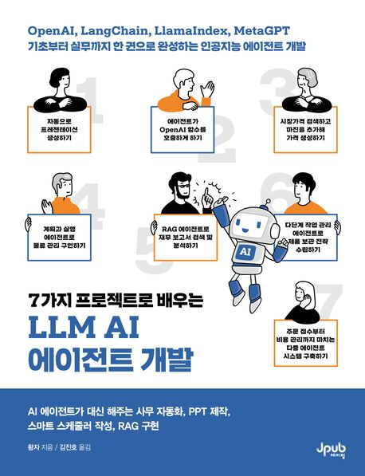

# 📚 [F-LAB] LLM AI 에이전트 개발 북스터디

> **"7가지 프로젝트로 배우는 LLM AI 에이전트 개발"** 도서를 기반으로, LLM의 작동 원리부터 실전 에이전트 구축까지 학습한 내용을 정리하고 실습하는 저장소입니다.

## 🚀 개요

* **기간**: 2026.01.24 ~ 진행 중
* **목표**:
* LLM(Large Language Model)의 핵심 메커니즘 이해
* LangChain, AutoGPT, ReAct 등 에이전트 프레임워크 숙달
* 7가지 실전 프로젝트 구현을 통한 실무 감각 배양

---